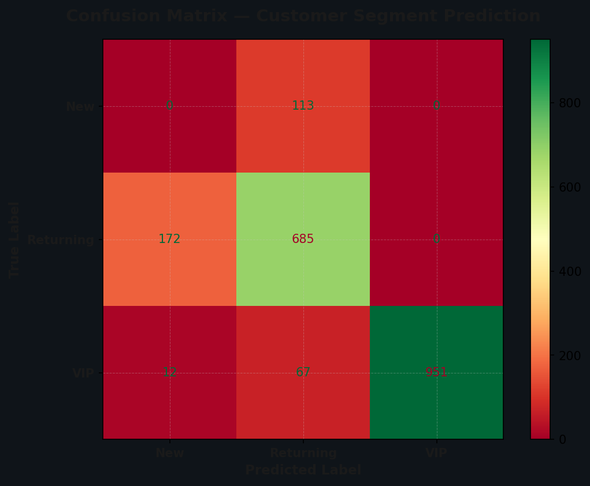
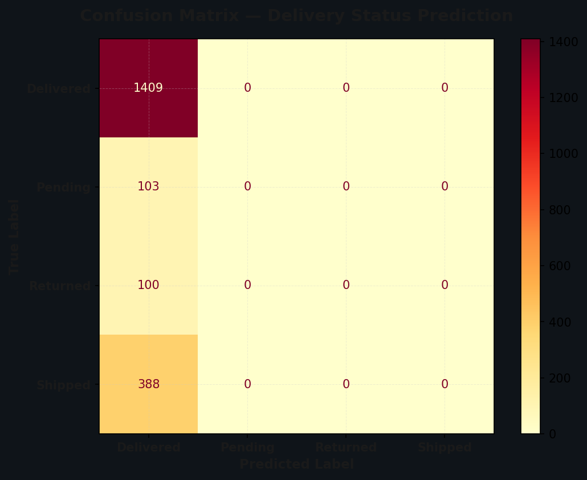
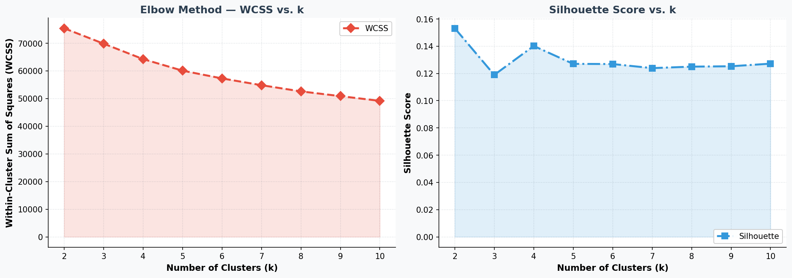
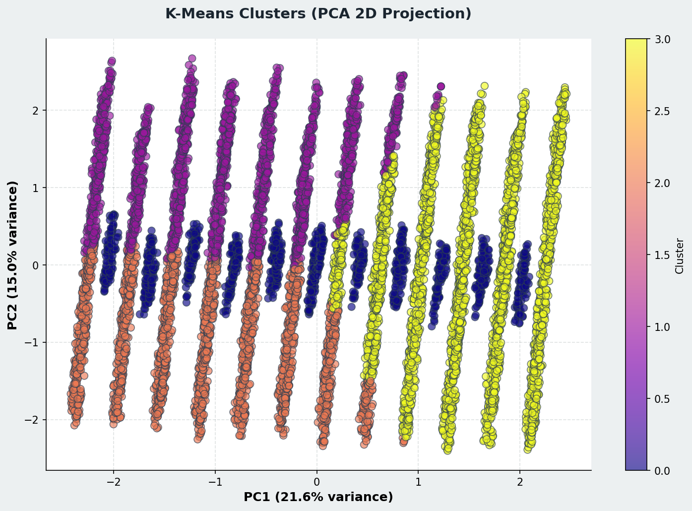
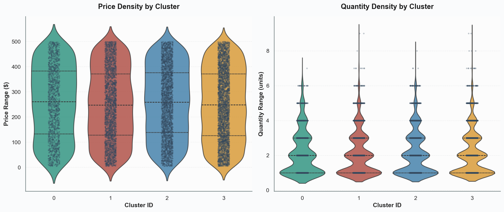
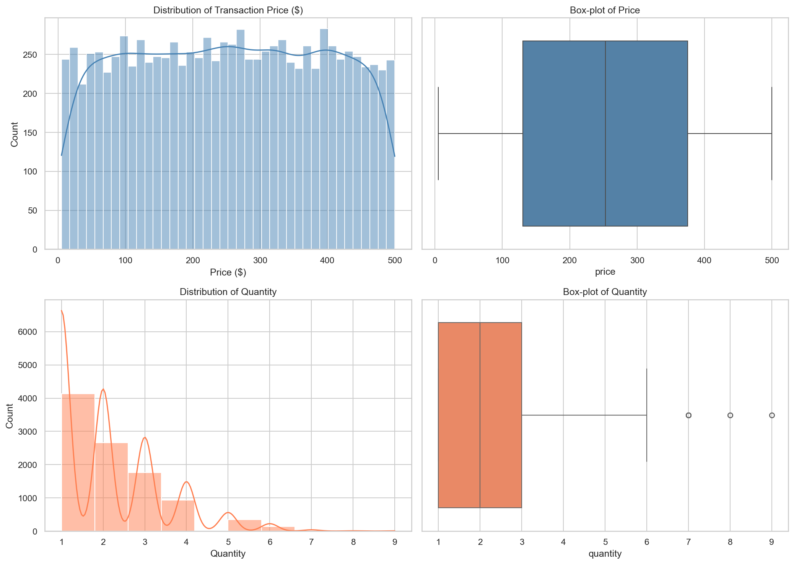
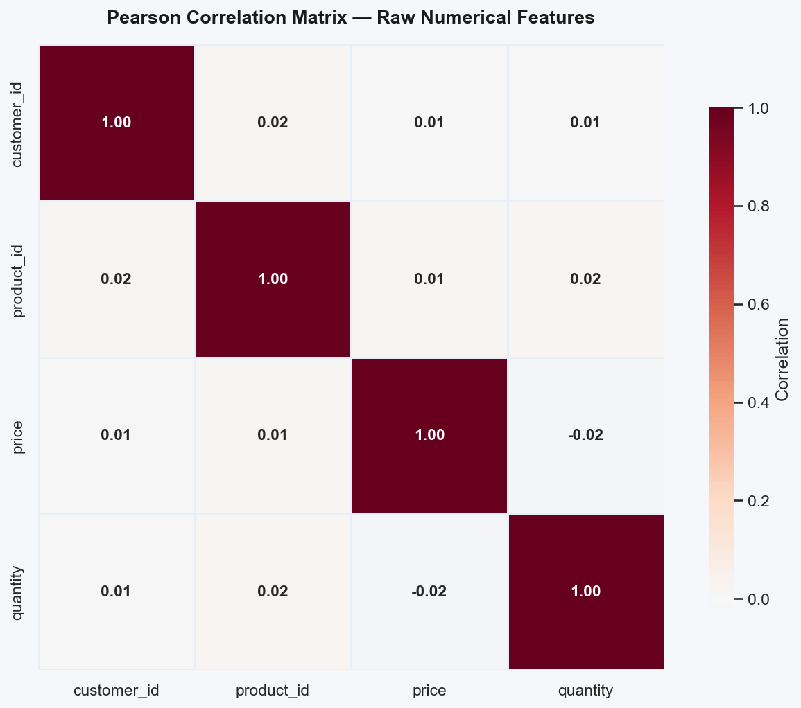
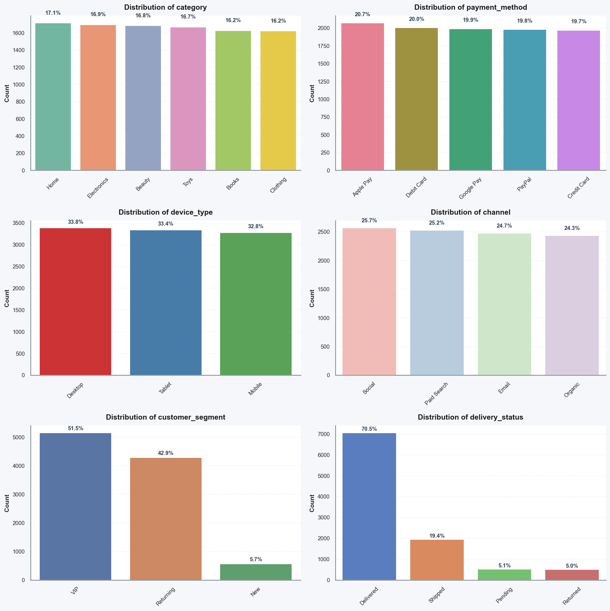
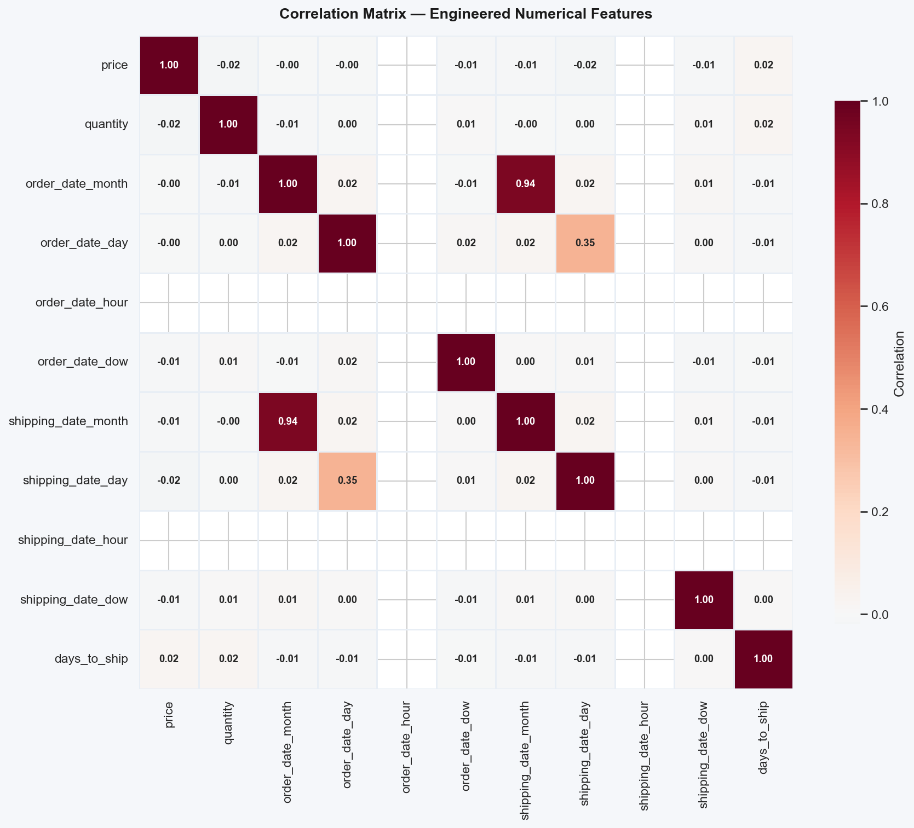

# AuraCart Sentinel

**Production-Grade E-Commerce Analytics and MLOps System**

AuraCart Sentinel is an end-to-end machine learning system built to drive intelligent decision-making for AuraCart, a mid-scale e-commerce platform. The system covers three concurrent analytical tasks — price prediction (regression), customer segment and delivery status classification (multi-class), and customer behaviour discovery (unsupervised clustering) — and is fully deployed to Google Cloud Vertex AI via an MLflow-tracked production pipeline.

---

## Table of Contents

- [Project Overview](#project-overview)
- [Dataset](#dataset)
- [Project Structure](#project-structure)
- [Notebooks](#notebooks)
- [Results](#results)
  - [Regression: Order Price Prediction](#regression-order-price-prediction)
  - [Classification: Customer Segment](#classification-customer-segment)
  - [Classification: Delivery Status](#classification-delivery-status)
  - [Clustering: Customer Behaviour](#clustering-customer-behaviour)
- [MLflow Experiment Tracking](#mlflow-experiment-tracking)
- [Deployment: Google Cloud Vertex AI](#deployment-google-cloud-vertex-ai)
- [Setup and Installation](#setup-and-installation)
- [Team](#team)

---

## Project Overview

| Attribute      | Detail                                               |
|----------------|------------------------------------------------------|
| Module         | ITS 2140 — Machine Learning                          |
| Programme      | Higher Diploma in Software Engineering (HDSE 69/70)  |
| Batch          | GDSE 69 (Panadura)                                   |
| Group          | CoreGenix                                            |
| Dataset        | `millat/e-commerce-orders` (Hugging Face)            |
| Records        | 10,000 orders                                        |
| ML Framework   | Scikit-learn, LightGBM, MLflow                       |
| Cloud Platform | Google Cloud Vertex AI                               |

---

## Dataset

The dataset is sourced from Hugging Face (`millat/e-commerce-orders`) and contains 10,000 e-commerce transaction records with the following characteristics:

**Target Variables:**

| Target             | Classes                                    | Imbalance                   |
|--------------------|--------------------------------------------|-----------------------------|
| `customer_segment` | New, Returning, VIP                        | 50% / 35% / 15%             |
| `delivery_status`  | Delivered, Shipped, Pending, Returned      | 70% / 20% / 5% / 5%        |
| `price`            | Continuous ($5–$500)                       | Uniform distribution         |

---

## Project Structure

```
AuraCart_Sentinel_Complete_Project/
│
├── notebooks/
│   ├── 1_eda_and_preprocessing.ipynb       # EDA, cleaning, feature engineering, preprocessing pipeline
│   ├── 2_supervised_modeling.ipynb         # Regression + multi-class classification
│   ├── 3_unsupervised_clustering.ipynb     # K-Means clustering
│   └── 4_mlops_deployment.ipynb            # MLflow logging + Vertex AI deployment
│
├── artifacts/
│   ├── model.joblib                        # Final serialised deployment pipeline
│   ├── preprocessing_pipeline.joblib       # Reusable preprocessing artifact
│   └── requirements.txt                    # Python dependency versions
│
├── reports/
│   ├── figures/                            # Auto-generated chart exports (PNG)
│   └── final/
│       └── ITS2140_ML_Project_Report.md    # Final project report
│
├── screenshots/
│   ├── mlflow/                             # MLflow UI evidence screenshots
│   └── vertex_ai/                          # Vertex AI deployment screenshots
│
└── README.md
```

---

## Notebooks

| # | Notebook | Purpose |
|---|----------|---------|
| 1 | `1_eda_and_preprocessing.ipynb` | Exploratory data analysis, feature engineering, Scikit-learn preprocessing pipeline |
| 2 | `2_supervised_modeling.ipynb` | Linear regression (OLS + SGD), multi-class classification (Gradient Boosting, LightGBM, ensemble) |
| 3 | `3_unsupervised_clustering.ipynb` | K-Means clustering with elbow method, silhouette scores, PCA visualisation |
| 4 | `4_mlops_deployment.ipynb` | MLflow experiment tracking, model serialisation, Vertex AI deployment |

---

## Results

### Regression: Order Price Prediction

Linear Regression (OLS) with 5-Fold cross-validation. SGD was tested across 5 hyperparameter configurations to observe learning rate and epoch effects.

| Metric         | Value               |
|---------------|---------------------|
| Test MAE      | $98.94              |
| Test RMSE     | $122.23             |
| CV MAE (mean) | $97.52 (±$0.89)     |
| CV MSE (mean) | 14,487.70 (±275.57) |

> **Finding:** Training MSE ≈ CV MSE indicates mild underfitting — expected for synthetic data without strong price signals.

---

### Classification: Customer Segment

The champion model is a **Gradient Boosting Classifier** (n_estimators=300, max_depth=5, learning_rate=0.1) with six leakage-free customer behavioural features engineered from training data only.

| Metric        | Value    |
|--------------|----------|
| Test Accuracy | **81.80%** |
| Weighted F1   | 0.8165   |
| Log-Loss      | 0.5742   |

**Model Comparison:**

| Model               | Accuracy |
|---------------------|----------|
| Logistic Regression | 75.00%   |
| Random Forest       | 67.65%   |
| **Gradient Boosting** | **81.80%** |



---

### Classification: Delivery Status

A baseline Logistic Regression model without class reweighting, achieving 70.45% by correctly learning the majority class distribution.

| Metric        | Value    |
|--------------|----------|
| Test Accuracy | **70.45%** |
| Weighted F1   | 0.5894   |



---

### Clustering: Customer Behaviour

K-Means clustering applied to scaled numerical features. Optimal k=4 was determined via the Elbow Method and Silhouette Scores.



**Discovered Customer Clusters:**

| Cluster | Interpretation               | Business Action                   |
|---------|------------------------------|-----------------------------------|
| 0       | Slow-fulfilment orders       | Logistics optimisation            |
| 1       | Budget-conscious buyers      | Discount promotions               |
| 2       | Premium / VIP customers      | Premium service, loyalty rewards  |
| 3       | Average / returning segment  | Retention campaigns               |





**Exploratory Analysis:**









---

## MLflow Experiment Tracking

All experiments are tracked in MLflow across three experiment groups:

- **AuraCart_Regression** — 6 runs (OLS + 5 SGD configurations)
- **AuraCart_Classification** — 15+ runs (LR, RF, GBM, LightGBM, ensemble, cost-sensitive)
- **AuraCart_Deployment** — Final champion model logging

Each run logs: model type, hyperparameters, accuracy, F1, log-loss/MSE/MAE, and the serialised pipeline artifact.

**Experiments Overview:**


**Regression Runs:**


**Classification Champion Run:**


**Clustering Run Details:**


**Model Comparison — Why Champion Was Selected:**


**Logged Model Artifacts:**


---

## Deployment: Google Cloud Vertex AI

The champion customer segment model is packaged as a unified Scikit-learn Pipeline and deployed to Google Cloud Vertex AI.

**Deployment steps:**
1. Artifacts uploaded to GCS bucket: `auracart-sentinel-ml01-artifacts`
2. Model registered in Vertex AI Model Registry (Scikit-learn container)
3. Endpoint deployed: `auracart-segment-endpoint` (n1-standard-2, 100% traffic)
4. Live prediction tested via REST API

**Active Endpoint:**


**Endpoint Configuration and Traffic Routing:**


**Live Prediction Output:**


**Sample Prediction Payload:**

```json
{
  "instances": [
    {
      "category": "Electronics",
      "quantity": 3,
      "payment_method": "Credit Card",
      "device_type": "Mobile",
      "channel": "Organic",
      "order_date_month": 6,
      "days_to_ship": 3
    }
  ]
}
```

---

## Setup and Installation

```bash
# Clone / navigate to project directory
cd AuraCart_Sentinel_Complete_Project

# Create virtual environment
python -m venv .venv
.venv\Scripts\activate        # Windows
# source .venv/bin/activate   # Linux/macOS

# Install dependencies
pip install -r artifacts/requirements.txt
pip install mlflow datasets lightgbm xgboost
```

**Run notebooks in order:**

1. `notebooks/1_eda_and_preprocessing.ipynb`
2. `notebooks/2_supervised_modeling.ipynb`
3. `notebooks/3_unsupervised_clustering.ipynb`
4. `notebooks/4_mlops_deployment.ipynb`

**View MLflow UI:**

```bash
mlflow ui
# Navigate to http://localhost:5000
```

---

## Team

**Group: CoreGenix | GDSE 69 (Panadura)**

| Name                             | Student ID  | Role         |
|----------------------------------|-------------|-------------|
| Dilusha Sandaruwan Karunathilaka | 2301691099  | Group Leader |
| Madusha Lakmina                  | 2301691027  | Member       |
| Harsha Dilan                     | 2301691017  | Member       |
| Thanura Vipulanga                | 2301691013  | Member       |
| Chamod Thejan                    | 2301691108  | Member       |
| Dasun Wijayathilaka              | 2301691094  | Member       |

---

*ITS 2140 Machine Learning Group Project — April 2026*
